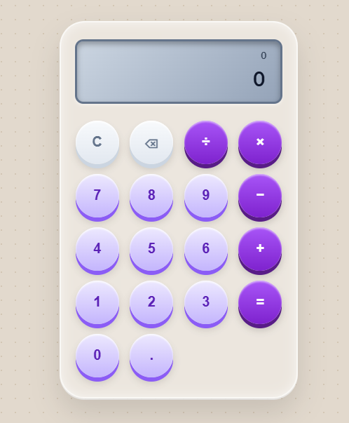

# 🧮 Calculator

A fully functional browser-based calculator built with **HTML5, CSS3, and Vanilla JavaScript**. This project provides a clean and user-friendly interface for performing basic arithmetic operations with proper input handling and error management.

This project was developed as part of the **Oasis Infobyte Web Development Internship Program**.

---

## 📌 Project Overview

The Calculator is designed to perform basic arithmetic calculations directly in the browser without using external libraries or frameworks.

The project focuses on building the calculator interface with CSS Grid and implementing the calculation logic using JavaScript event listeners, variables, conditional statements, `switch`, and `parseFloat()`.

The application does **not** use JavaScript's `eval()` function.

---

## ✨ Features

* 🔢 Numeric buttons from **0–9**
* 🔹 Decimal point support
* ➕ Addition
* ➖ Subtraction
* ✖️ Multiplication
* ➗ Division
* 🟰 Equals button for calculating results
* 🧹 Clear button to reset the calculator
* ⌫ Backspace button to remove the last entered character
* 🔗 Sequential operator chaining
* ⚠️ Division-by-zero error handling
* 📱 Responsive layout for smaller screens
* 🎨 Clean and user-friendly interface
* ⌨️ Event listeners for button interactions
* 📐 CSS Grid-based calculator layout

---

## 🛠️ Technologies Used

* **HTML5** — Structure and calculator interface
* **CSS3** — Styling, responsive design, and CSS Grid layout
* **JavaScript (Vanilla)** — Calculator logic and user interactions

No external JavaScript frameworks or libraries are used.

---

## 📂 Project Structure

```text
WebDev-L1-Calculator/
│
├── index.html
├── style.css
├── script.js
└── README.md
```

### File Description

| File         | Description                                               |
| ------------ | --------------------------------------------------------- |
| `index.html` | Contains the calculator structure and buttons             |
| `style.css`  | Handles the calculator design, layout, and responsiveness |
| `script.js`  | Contains the calculator logic and event handling          |
| `README.md`  | Project documentation                                     |

---

## ⚙️ How It Works

The calculator uses JavaScript variables to keep track of:

* The first number
* The current number
* The selected arithmetic operator
* The current calculation state

When a user selects an operator, the calculator stores the required values and performs the operation when the next number or operator is entered.

The calculation logic is implemented using a JavaScript `switch` statement.

### Example

```text
5 + 3 = 8
```

The calculator stores:

```text
First Number → 5
Operator     → +
Second Number → 3
Result       → 8
```

---

## 🔐 Error Handling

The calculator prevents division by zero.

For example:

```text
10 ÷ 0
```

Instead of producing an invalid result, the calculator displays an error message:

```text
Error
Cannot divide by zero
```

The calculator also prevents entering multiple decimal points within the same number.

---

## 🔗 Operator Chaining

The calculator supports sequential calculations without requiring a reset.

For example:

```text
5 + 3 + 2
```

The calculator processes the operations sequentially and produces:

```text
10
```

This allows users to perform multiple calculations continuously.

---

## 🎨 Interface

The calculator uses a **CSS Grid** layout to organize the buttons into rows and columns.

The interface includes separate visual sections for:

* Current input
* Calculation result
* Number buttons
* Operator buttons
* Clear button
* Delete button
* Equals button

The layout is also responsive for smaller screen sizes.

---

## 🚀 How to Run the Project

### Option 1 — Browser

1. Download or clone the repository.
2. Open the project folder.
3. Open `index.html` in a web browser.

### Option 2 — VS Code Live Server

1. Open the project folder in VS Code.
2. Install the **Live Server** extension.
3. Open `index.html`.
4. Right-click on the file.
5. Select **Open with Live Server**.

The calculator will open in your default browser.

---

## 🧪 Test Cases

| Test             | Input       | Expected Result |
| ---------------- | ----------- | --------------- |
| Addition         | `5 + 3`     | `8`             |
| Subtraction      | `10 - 4`    | `6`             |
| Multiplication   | `7 × 3`     | `21`            |
| Division         | `20 ÷ 5`    | `4`             |
| Decimal          | `2.5 + 1.5` | `4`             |
| Division by Zero | `10 ÷ 0`    | Error           |
| Backspace        | `12345 → ⌫` | `1234`          |
| Clear            | `123 → C`   | `0`             |

---

## 📸 Screenshots

Screenshots of the completed project can be added below.

### Calculator Interface




---

## 🎥 Demo

A screen-recorded demonstration of the project can be added here.

**Demo Video:** [Add your demo video link here]

The demonstration shows the calculator interface, arithmetic operations, error handling, and other implemented features.

---

## 📚 Learning Resources

The project was developed using the following learning resources and documentation:

* [MDN Web Docs — addEventListener()](https://developer.mozilla.org/en-US/docs/Web/API/EventTarget/addEventListener)
* [MDN Web Docs — switch](https://developer.mozilla.org/en-US/docs/Web/JavaScript/Reference/Statements/switch)
* [MDN Web Docs — parseFloat()](https://developer.mozilla.org/en-US/docs/Web/JavaScript/Reference/Global_Objects/parseFloat)
* YouTube search reference: **"vanilla JavaScript calculator project tutorial"**

---

## 👩‍💻 Author

**Nishat Yeasmin Nisha**

CSE Student | Junior Frontend Developer

* GitHub: [Nishat-Yeasmin](https://github.com/Nishat-Yeasmin)
* LinkedIn: [Nishat Yeasmin](https://www.linkedin.com/in/nishatyeasmin/)

---

## 📄 Internship

**Oasis Infobyte — Web Development Internship Program**

Project: **Calculator**

Technology: **HTML5 | CSS3 | Vanilla JavaScript**
