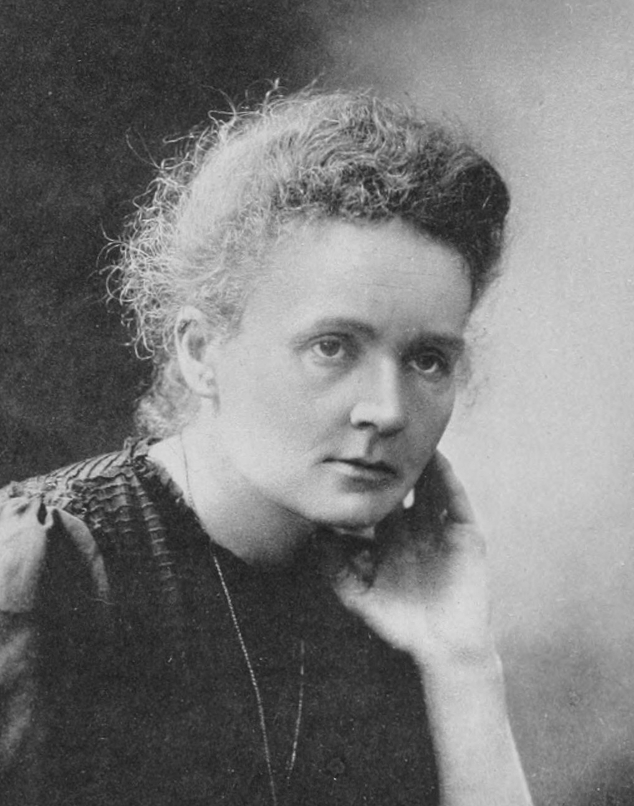
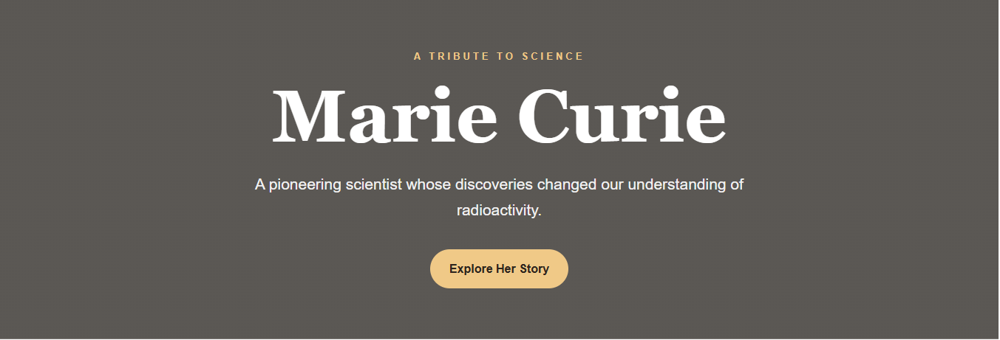
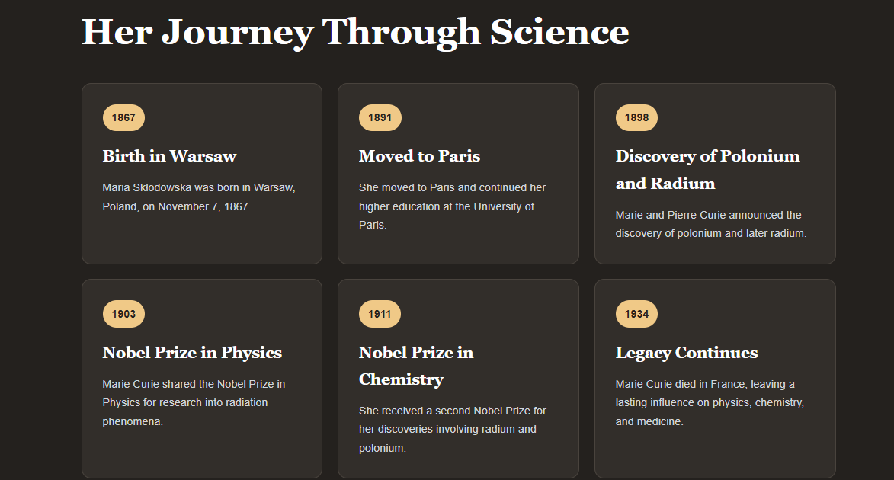
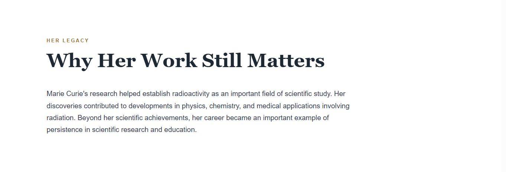

# 🌟 Marie Curie — Tribute Page

<p align="center">
  
</p>

<p align="center">
  <strong>A tribute to a pioneering scientist whose discoveries transformed the study of radioactivity.</strong>
</p>

---

## 📌 Project Overview

This project is a responsive tribute page dedicated to **Marie Curie**, one of the most influential scientists in the history of modern science.

The page presents an overview of her life, scientific achievements, major milestones, and lasting legacy through a clean and visually engaging web design.

This project was developed as part of the **Oasis Infobyte Web Development Internship Program — Task 2: Tribute Page**.

---

## ✨ Features

* 🎨 Clean and visually engaging design
* 🖼️ Prominent Marie Curie image
* 📖 Biography section with original paraphrased content
* 🏆 Key achievements and important milestones
* 🕰️ Timeline-style achievement cards
* 💬 Distinctive quote section
* 🎨 Multiple background colours across sections
* 🔤 Different font styles for headings and body text
* 📱 Fully responsive layout
* ✨ Hover effects and smooth scrolling
* 🔗 Navigation button to the biography section

---

## 🛠️ Technologies Used

* **HTML5**
* **CSS3**

JavaScript was not required for this project.

---

## 📂 Project Structure

```text
WebDev-L2-TributePage/
│
├── index.html
├── style.css
├── README.md
│
└── images/
    ├── Marie_Curie.jpg
    ├── hero-section.png
    ├── timeline.png
    ├── legacy.png
    └── qoute.png
```

### File Description

| File / Folder | Purpose                                                     |
| ------------- | ----------------------------------------------------------- |
| `index.html`  | Contains the structure and content of the tribute page      |
| `style.css`   | Contains styling, layout, animations, and responsive design |
| `README.md`   | Project documentation                                       |
| `images/`     | Contains the project image and screenshots                  |

---

## 📖 About Marie Curie

Marie Curie was born **Maria Skłodowska** in Warsaw, Poland, in 1867. She later moved to Paris to continue her higher education and studied at the University of Paris.

Her scientific research focused on radiation phenomena. Working with Pierre Curie, she discovered the elements **polonium and radium**, contributing significantly to the emerging field of radioactivity.

In **1903**, Marie Curie received the **Nobel Prize in Physics** for research into radiation phenomena. In **1911**, she received the **Nobel Prize in Chemistry** for her work involving radium and polonium.

Her scientific work also contributed to medical applications of radiation. During World War I, she supported the use of mobile X-ray units to help doctors examine wounded soldiers.

---

## 🕰️ Key Milestones

| Year     | Milestone                                           |
| -------- | --------------------------------------------------- |
| **1867** | Born in Warsaw, Poland                              |
| **1891** | Moved to Paris for higher education                 |
| **1898** | Discovery of polonium and radium                    |
| **1903** | Received the Nobel Prize in Physics                 |
| **1911** | Received the Nobel Prize in Chemistry               |
| **1934** | Died in France, leaving a lasting scientific legacy |

---

## 💬 Featured Quote

> **“Nothing in life is to be feared, it is only to be understood.”**

— Marie Curie

---

## 🎨 Design & Layout

The page uses different visual styles to create a clear separation between sections.

### Typography

* **Georgia / Times New Roman** — Used for major headings and quote text
* **Arial / Helvetica** — Used for general body content

### Colour Sections

The page includes multiple background colours, including:

* Light cream
* White
* Dark charcoal
* Warm beige

This creates visual contrast between the biography, timeline, quote, and legacy sections.

---

## 📱 Responsive Design

The website is designed to work across different screen sizes.

The layout adapts for:

* 💻 Desktop
* 📱 Mobile
* 📲 Tablet

The timeline cards change their column layout on smaller screens to maintain readability and usability.

---

## 🚀 How to Run

### Option 1 — Open Directly

1. Clone or download the repository.
2. Open the `WebDev-L2-TributePage` folder.
3. Open `index.html` in a web browser.

### Option 2 — VS Code Live Server

1. Open the project folder in VS Code.
2. Install the **Live Server** extension.
3. Open `index.html`.
4. Right-click the file.
5. Select **Open with Live Server**.

---

## 📸 Project Screenshots

### Hero Section



### Biography & Timeline



### Quote Section


### Legacy Section



---

## 📚 Sources & References

The factual information about Marie Curie's life and scientific contributions was researched using reliable reference sources and paraphrased for this project.

* [Wikipedia — Marie Curie](https://en.wikipedia.org/wiki/Marie_Curie)
* [Encyclopaedia Britannica — Marie Curie](https://www.britannica.com/biography/Marie-Curie)
* [Wikimedia Commons — Marie Curie](https://commons.wikimedia.org/wiki/Category:Marie_Curie)
* [MDN Web Docs — HTML](https://developer.mozilla.org/en-US/docs/Web/HTML)
* [MDN Web Docs — CSS](https://developer.mozilla.org/en-US/docs/Web/CSS)

### Image Source

The Marie Curie image used in this project was sourced from **Wikimedia Commons**.

> The exact Wikimedia Commons image page should be linked here after selecting the final image.

---

## 🎯 Internship Task

**Program:** Oasis Infobyte Web Development Internship

**Task:** Task 2 — Tribute Page

**Subject:** Marie Curie

**Technology:** HTML5 & CSS3

---

## 👩‍💻 Author

**Nishat Yeasmin Nisha**

CSE Student | Junior Frontend Developer

* GitHub: [Nishat-Yeasmin](https://github.com/Nishat-Yeasmin)
* LinkedIn: [Nishat Yeasmin](https://www.linkedin.com/in/nishatyeasmin/)

---

## 📄 License

This project was created for educational and internship purposes.
